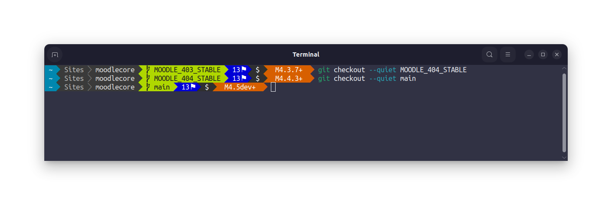

# `powerline-go-moodle`

## A Moodle plugin for [`powerline-go`](https://github.com/justjanne/powerline-go)

This plugin adds a segment which displays the [Moodle](https://moodle.org) version the current directory belongs to.



It works by finding the parent directory containing a composer.json for a project called "moodle/moodle", then parses the $release variable from the version.php file. It also works for [Totara](https://www.totara.com/).

## Installation

Builds of `powerline-go-moodle` are available for Linux, MacOS and Windows on amd64, arm64 and x86 architectures.

### Snap

On ubuntu and other supported Linux distributions, the easiest way to get `powerline-go-moodle` is to install the snap:

```
snap install powerline-go-moodle
```

Due to strict confinement of snaps, the plugin will only be able to run within your home directory by default. It can also run on volumes mounted under `/media` if you connect the removable-media plug:

```
sudo snap connect powerline-go-moodle:removable-media
```

### Pre-built binary

If you cannot use the snap, pre-built binaries are available on the [Releases page](https://github.com/marxjohnson/powerline-go-moodle/releases).

Download the binary, put it somewhere in your `$PATH`, and run `chmod +x powerline-go-moodle` to make it executable.

### Build

For all other cases, you can build from source. You will need to have [go](https://go.dev/) installed.

Clone this repository and run `go install`

```bash
git clone https://github.com/marxjohnson/powerline-go-moodle
cd powerline-go-moodle
go install
```

This will place the `powerline-go-moodle` binary in your `$GODIR/bin` directory. Make sure this is added to your `$PATH`.

To confirm it is working, `cd` to a directory containing a Moodle codebase and run `powerline-go-moodle`

```bash
$ cd moodle
$ powerline-go-moodle
[{"name":"moodle","content":"M4.5dev+","foreground":15,"background":166}]
```

## Usage

Add `moodle` to the `-modules` argument when you configure `powerline-go` for your shell. 
For example, for Bash, your `.bashrc` should contain something like:

```bash
function _update_ps1() {
    PS1="$($HOME/go/bin/powerline-go \
	    -error $? \
	    -jobs $(jobs -p | wc -l) \
	    -hostname-only-if-ssh \
	    -modules 'aws,cwd,git,root,exit,moodle')"

    # Uncomment the following line to automatically clear errors after showing
    # them once. This not only clears the error for powerline-go, but also for
    # everything else you run in that shell. Don't enable this if you're not
    # sure this is what you want.

    #set "?"
}
```
